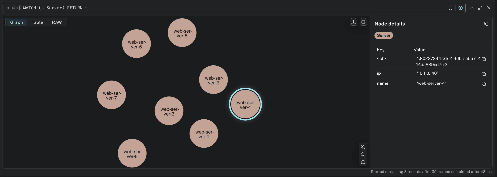
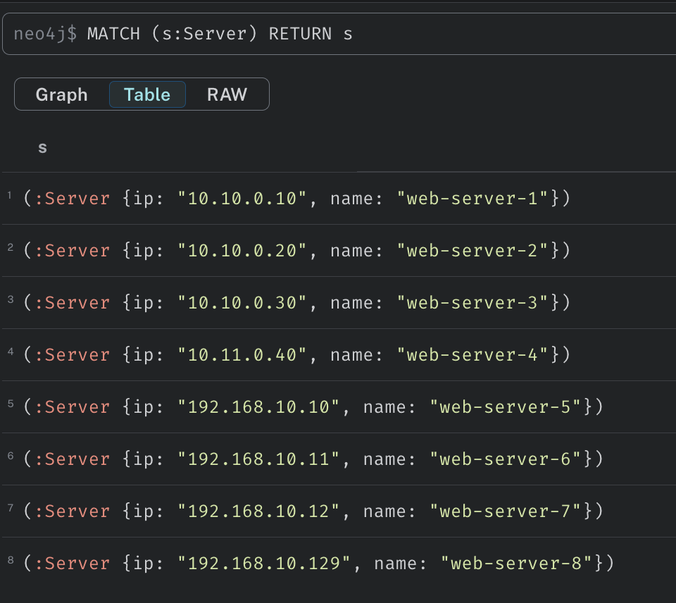
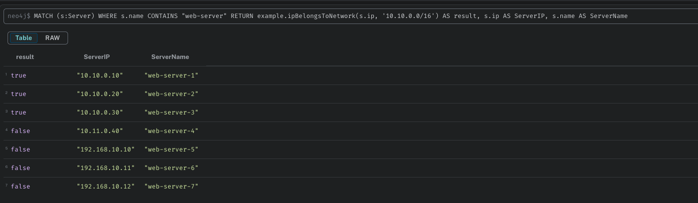
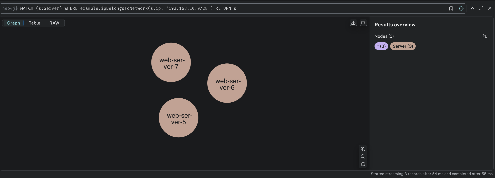

# User Defined Function for Neo4j: IP Address Network Verification

This project is designed to extend Neo4j's capabilities by implementing a User Defined Function (UDF) that checks if an IP address belongs to a specified network segment. It's an excellent resource for developers looking to integrate network validation within their Neo4j graph databases.

## Project Overview

The UDF enables users to verify whether the `ip` property of a node (specifically a server node) belongs to a defined network. This can be especially useful in network management applications, monitoring systems, or any scenario where IP allocation must be verified against predefined subnets.

## Example Usage

In this example, we assume that your Neo4j database contains several server nodes, each with an `ip` property representing its IP address.

### 1. Node Representation



You can visualize the nodes in your database with the label `Server`, which represent various servers.

### 2. Display IP Addresses

To view the IP addresses stored in your nodes, you can execute a query that displays a table of these nodes and their properties:



### 3. Using the UDF

To utilize the UDF, perform a query to filter nodes based on a specific condition (e.g., matching labels and names) and then check if the associated IP address belongs to a specified network segment.

For example, to find all nodes with the label `:Server` that contain `web-server` in their `name` property and verify if their `ip` addresses belong to the network `10.10.0.0/16`, you would execute the following query:

```cypher
MATCH (s:Server)
WHERE s.name CONTAINS 'web-server'
RETURN s.ip, example.ipBelongsToNetwork(s.ip, '10.10.0.0/16') AS belongsToNetwork
```

### EXAMPLE-1:



### EXAMPLE-2:



