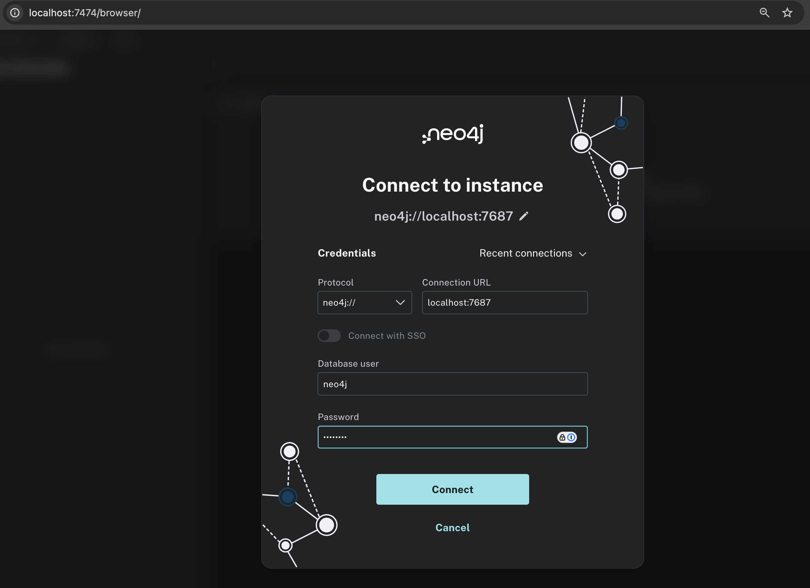
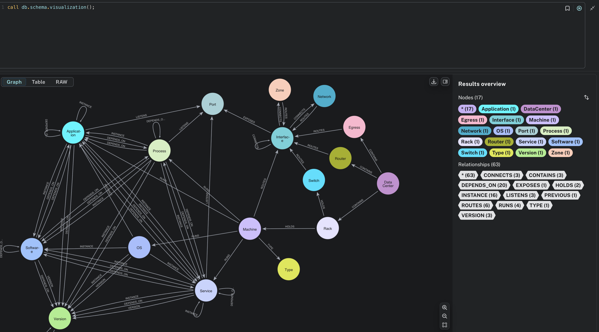
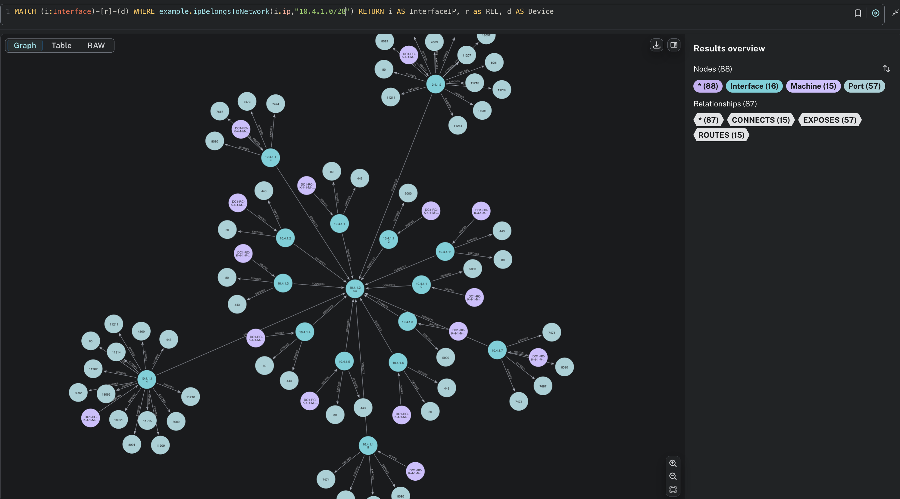
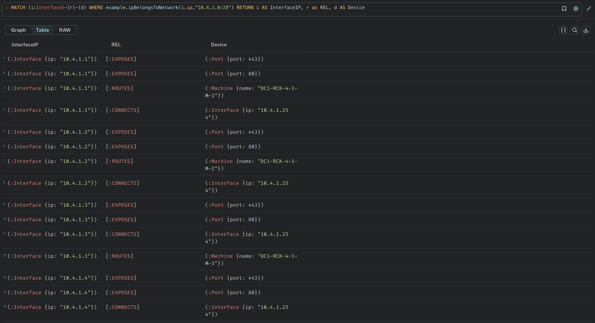

[](https://github.com/looeejee/neo-udf-cidr-check/actions/workflows/maven.yml)

# User Defined Function for Neo4j: IP Address Network Verification

This project is designed to extend Neo4j's capabilities by implementing a User Defined Function (UDF) that checks if an IP address belongs to a specified network segment. It's an excellent resource for developers looking to integrate network validation within their Neo4j graph databases.

## Project Overview

The UDF enables users to verify whether the `ip` property of a node (specifically a server node) belongs to a defined network. This can be especially useful in network management applications, monitoring systems, or any scenario where IP allocation must be verified against predefined subnets.

## Example Usage

In this example, we assume that your Neo4j database contains several server nodes, each with an `ip` property representing its IP address.

### 1. Node Representation


You can visualize the nodes in your database with the label `Server`, which represent various servers.

### 2. Display IP Addresses

To view the IP addresses stored in your nodes, you can execute a query that displays a table of these nodes and their properties:


### 3. Using the UDF

The example below indicate how to utilize the UDF to check if a node property containing information on an ipv4 address belongs to a specific network. 

### EXAMPLE-1:

In this example we perform a query to filter nodes based on a specific condition (e.g., matching labels and names) and then check if the associated IP address belongs to a specified network segment.
To find all nodes with the label `:Server` that contain `web-server` in their `name` property and verify if their `ip` addresses belong to the network `10.10.0.0/16`, you would execute the following query:

```cypher
MATCH (s:Server)
WHERE s.name CONTAINS 'web-server'
RETURN s.ip, example.ipBelongsToNetwork(s.ip, '10.10.0.0/16') AS belongsToNetwork
```


### EXAMPLE-2:

Filter nodes based on whether the value of the node property IP belongs to the specified network

```cypher
MATCH (s:Server) WHERE example.ipBelongsToNetwork(s.ip, '192.168.10.0/28') RETURN s
```


### EXAMPLE-3:

For this example we create a more complex graph representing a large network. The dataset used for this example was extracted from the existing repository:

https://github.com/neo4j-graph-examples/network-management

For the scope of this Project a docker image was created to import the dataset and configure the UDF that will be used to filter Nodes based on the value of IP node property.

To build and run this image locally execute the docker commands:

```
docker buildx build -t neo-udf-ip-check:1.0

docker run -it -p 7474:7474 -p 7687:7687 --env=NEO4J_ACCEPT_LICENSE_AGREEMENT=yes --env=NEO4J_AUTH=neo4j/<PASSWORD> neo-udf-ip-check:1.0
```

Once the Container is Up and running, connect to it by opening a web browser and access Neo4j Browser via the URL `https://localhost:7474`

Login using the credentials defined in the step above.



Once logged in we can review and familiarize ourselves with the nodes and relationships contained in the graph using the Cypher command:

```cypher
CALL db.schema.visualization();
```




We can then test the UDF to filter Interfaces based on whether their node property `ip` belongs to a specific network:

*example*

```cypher
MATCH (i:Interface)-[r]-(d) WHERE example.ipBelongsToNetwork(i.ip,"10.4.1.0/28") RETURN i AS InterfaceIP, r as REL, d AS Device
```

OUTPUT





